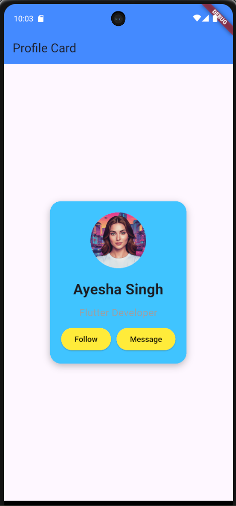

# 📱 Profile Card App

A simple and clean Flutter UI project where I built a **Profile Card**.
This project helped me understand basic Flutter layout and styling concepts.

---

## 🚀 Features

* 👤 Profile Image (Circle Avatar)
* 📝 Name and Bio section
* 🔘 Follow & Message Buttons
* 🎨 Clean and modern UI design
* 📱 Centered card layout

---

## 🛠️ Built With

* Flutter
* Dart

---

## 📸 Screenshots

---

## 🧠 What I Learned

* How to use **Container, Column, Row**
* How to display images using **AssetImage**
* How to design UI using **padding, margin, border radius, shadow**
* How to create and style buttons
* Basic layout structure in Flutter

---

## 🎯 Future Improvements

* Add button functionality (Follow → Following)
* Improve UI design (colors, spacing, icons)
* Make UI responsive for all screen sizes

---

## 📂 Project Structure

assets/
├── images/
└── screenshots/

lib/
└── main.dart

---

## 👨‍💻 Author

**Ayush**
Flutter Beginner 🚀

---

## ⭐ If you like this project

Give it a ⭐ on GitHub!
